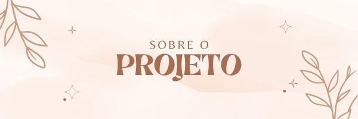

<!DOCTYPE html>
<html lang="pt-br" class="">
  <head>
    <link rel="preconnect" href="https://fonts.googleapis.com" />
    <link rel="preconnect" href="https://fonts.gstatic.com" crossorigin />
    <link
      href="https://fonts.googleapis.com/css2?family=Inter:ital,opsz,wght@0,14..32,100..900;1,14..32,100..900&family=Poppins:ital,wght@0,100;0,200;0,300;0,400;0,500;0,600;0,700;0,800;0,900;1,100;1,200;1,300;1,400;1,500;1,600;1,700;1,800;1,900&display=swap"
      rel="stylesheet"
    />
    <link
      href="https://fonts.googleapis.com/css2?family=Belleza&family=Inter:ital,opsz,wght@0,14..32,100..900;1,14..32,100..900&family=Poppins:ital,wght@0,100;0,200;0,300;0,400;0,500;0,600;0,700;0,800;0,900;1,100;1,200;1,300;1,400;1,500;1,600;1,700;1,800;1,900&display=swap"
      rel="stylesheet"
    />
    <meta charset="UTF-8" />
    <meta name="viewport" content="width=device-width, initial-scale=1.0" />
    <title>Readme</title>
    <link rel="stylesheet" href="style.css" />
  </head>
  <body>
    

      
    

    

      Este é um projeto de página de perfil pessoal, desenvolvido com o objetivo
      de praticar conceitos de HTML, CSS e JavaScript, além de aplicar
      conhecimentos sobre alternância de temas e responsividade.
    

    
FUNCIONALIDADES

    

      <ul>
        <li>Alternância entre modo claro e escuro</li>
        <li>Foto de perfil e bio de apresentação</li>
        <li>Links para redes sociais</li>
      </ul>
    

    
TECNOLOGIAS

    

      <a
        href="https://learn.microsoft.com/pt-br/cpp/mfc/html-basics?view=msvc-170"
        target="_blank"
        >HTML</a
      >
      <a href="https://developer.mozilla.org/pt-BR/docs/Web/CSS" target="_blank"
        >CSS</a
      >
      <a
        href="https://developer.mozilla.org/pt-BR/docs/Web/JavaScript"
        target="_blank"
        >JavaScript</a
      >
      <a href="https://docs.github.com/pt" target="_blank"
        >Git e GitHub</a
      >
    

    
STATUS DO PROJETO

    

      Em desenvolvimento. Novas melhorias visuais e funcionalidades podem ser
      adicionadas em breve
    

    
PREVIEW

    

      
    

    
  </body>
</html>