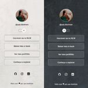

# Sobre o Projeto
  Este é um projeto de página de perfil pessoal, desenvolvido com o objetivo de praticar conceitos de HTML, CSS e JavaScript, além de aplicar conhecimento sobre alternância de temas e responsividade.

### FUNCIONALIDADES
- Alternância modo claro e escuro
- Foto de perfil e bio de apresentação
- Links para as redes sociais

### TECNOLOGIAS
  
  
  

### STATUS DO PROJETO
Em desenvolvimento. Novas melhoriasvisuais e funcionalidades podem ser adicionadas em breve.

### PREVIEW
 

### VIZUALIZAÇÃO ONLINE
Meu Perfil | https://yas-kbohnen.github.io/meu-perfil/
